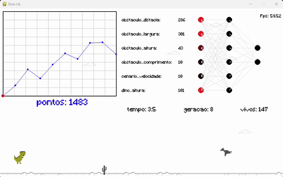

# 🦖 Dino I.A. - Jogo com Rede Neural  

Dino I.A. é um jogo baseado no clássico Dino Runner do Chrome, mas com um diferencial: uma Inteligência Artificial (IA) treinada para jogar sozinha!



## 🎮 Sobre o Projeto

O jogo utiliza um algoritmo evolutivo para treinar a IA, permitindo que ela melhore suas decisões a cada tentativa. Com isso, a I.A. se adapta aos obstáculos e aprende a alcançar distâncias cada vez maiores.

Além do modo treinamento, você também pode testar suas habilidades no modo Jogador vs. I.A., competindo diretamente contra o dinossauro inteligente.

Este projeto foi desenvolvido do zero(sem engine) com a biblioteca gráfica Pygame que é baseado na Simple DirectMedia Layer (SDL) alem de utilizar Numpy para lidar com arrays e técnicas de aprendizado de máquina, proporcionando uma experiência divertida e educativa para quem deseja entender melhor como uma I.A. aprende!

  A Rede Neural utilizada foi uma Multi-Layer Perceptron (MLP) com 3 camadas

  - Camada de Entrada com 6 sensores
  - Camada Escondida com 6 neurônios
  - Camada de Saída com 2 neurônios Pular ou Abaixar
  - Totalizando 14 neuronios
  - A função de ativação utilizada foi a Rectified Linear Unit (ReLU).
  - O método de aprendizagem foi o algoritmo evolutivo.
  - O tamanho da população foi de 500 indivíduos.
  - O tempo de aprendizagem variou entre 15 a 60.

## Por quê?

Fiz esse projeto para entender como redes neurais funcionam

## 🚀 Funcionalidades  
- 🎮 Modo Jogador vs. IA (`player_vs_IA.py`)  
- 🤖 Modo IA Aprendendo a Jogar (`dino_IA.py`)  
- 🧠 Rede Neural para aprendizado  
- 🎨 Gráficos e sons personalizados  

## 📂 Estrutura do Repositório  

```
- assets/               # Recursos visuais e sonoros
  ├── fonts/            # Fontes usadas no jogo
  ├── images/           # Imagens do jogo
  ├── sounds/           # Efeitos sonoros e música
  ├── icon.png          # Ícone do jogo
  └── preview.gif       # GIF de demonstração do jogo

- executaveis/          # Executaveis
  ├── dino_IA.rar       # Executavel do dino_IA
  ├── player_vs_IA.rar  # Executavel do player_vs_IA

- dino_IA.py            # Código da IA jogando sozinha
- dino_IA.spec          # Configuração do PyInstaller para gerar executável
- player_vs_IA.py       # Código para modo jogador vs IA
- player_vs_IA.spec     # Configuração do PyInstaller para modo jogador vs IA
- requirements.txt      # Dependências do projeto
- README.md             # Documentação do projeto
```

## 🛠️ Rodar no terminal

### 🔧 Pré-requisitos  
Antes de rodar o jogo, instale as dependências:  

```bash
pip install -r requirements.txt
```

### 🎢 Jogando  

Para jogar contra a IA:  

```bash
python player_vs_IA.py
```

Para ver a IA treinando:  

```bash
python dino_IA.py
```

## 🕹️ Rodar com o executavel

Extrair os arquivos detro da pasta executaveis e excutar o game


## 📦 Como Gerar o Executável  

Se quiser criar um executável, use:  

```bash
pyinstaller dino_IA.spec
pyinstaller player_vs_IA.spec
```

Os arquivos `.spec` já estão configurados para facilitar o processo.  

## 🐝 Licença  

Este projeto é open-source e está sob a licença [MIT](LICENSE).  

## ✨ Créditos  

Desenvolvido por Filipe Silva com Python, Pygame, Numpy e técnicas de IA.  

---
Se tiver sugestões, abra uma issue ou faça um fork e contribua! 🚀  

